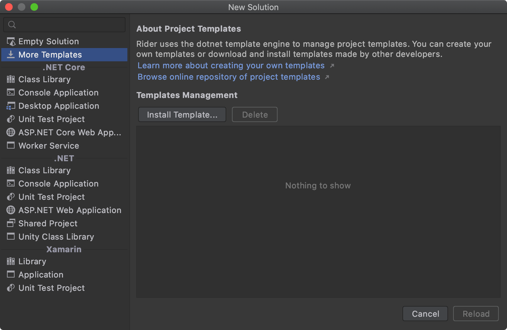
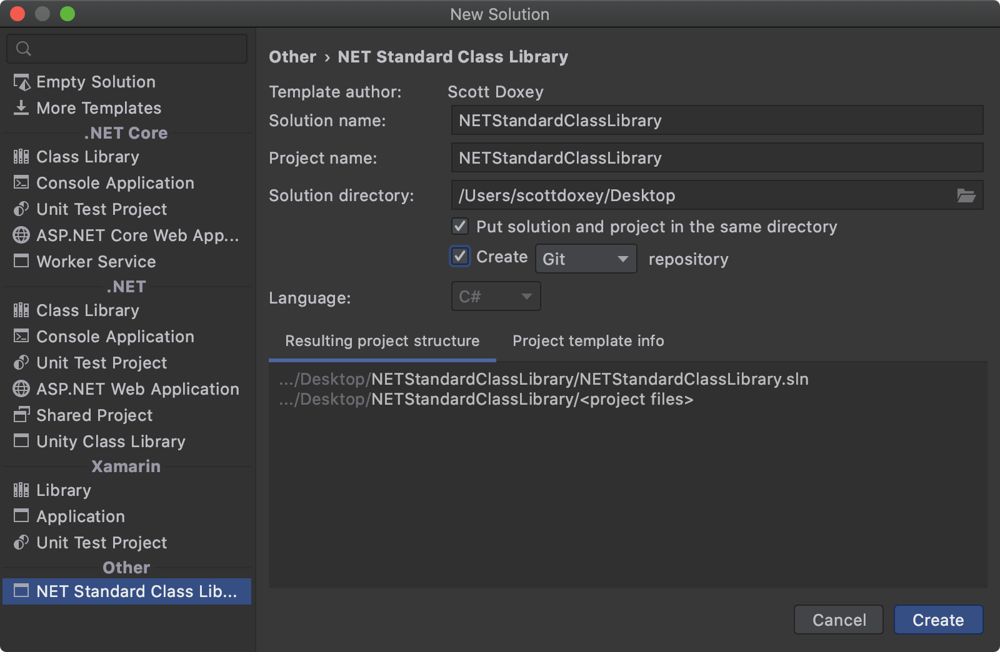

# .NET Standard Class Library Template

> Template for building a .NET Standard Class Library in Rider.

[](https://github.com/neogeek/NETStandardClassLibraryTemplate/actions/workflows/test.workflow.yml)
[](https://www.nuget.org/packages/com.scottdoxey.netstandardclasslibrary/)

## Install

### NuGet

```bash
$ dotnet new --install com.scottdoxey.netstandardclasslibrary::2.0.0
```

or download the latest package file from [releases](https://github.com/neogeek/NETStandardClassLibraryTemplate/releases) and install via the Project Templates dialog in Rider.



or via command line

```bash
$ dotnet new --install "com.scottdoxey.netstandardclasslibrary.2.0.0.nupkg"
```

### Repo

```bash
$ dotnet new --install "$(shell pwd)/NETStandardClassLibrary"
```

## Uninstall

### NuGet

```bash
$ dotnet new --uninstall com.scottdoxey.netstandardclasslibrary
```

### Repo

```bash
$ dotnet new --uninstall "$(shell pwd)/NETStandardClassLibrary"
```

## Setup



## Build Nuget

```bash
$ dotnet pack "$(shell pwd)/NETStandardClassLibraryTemplate.csproj"
```
